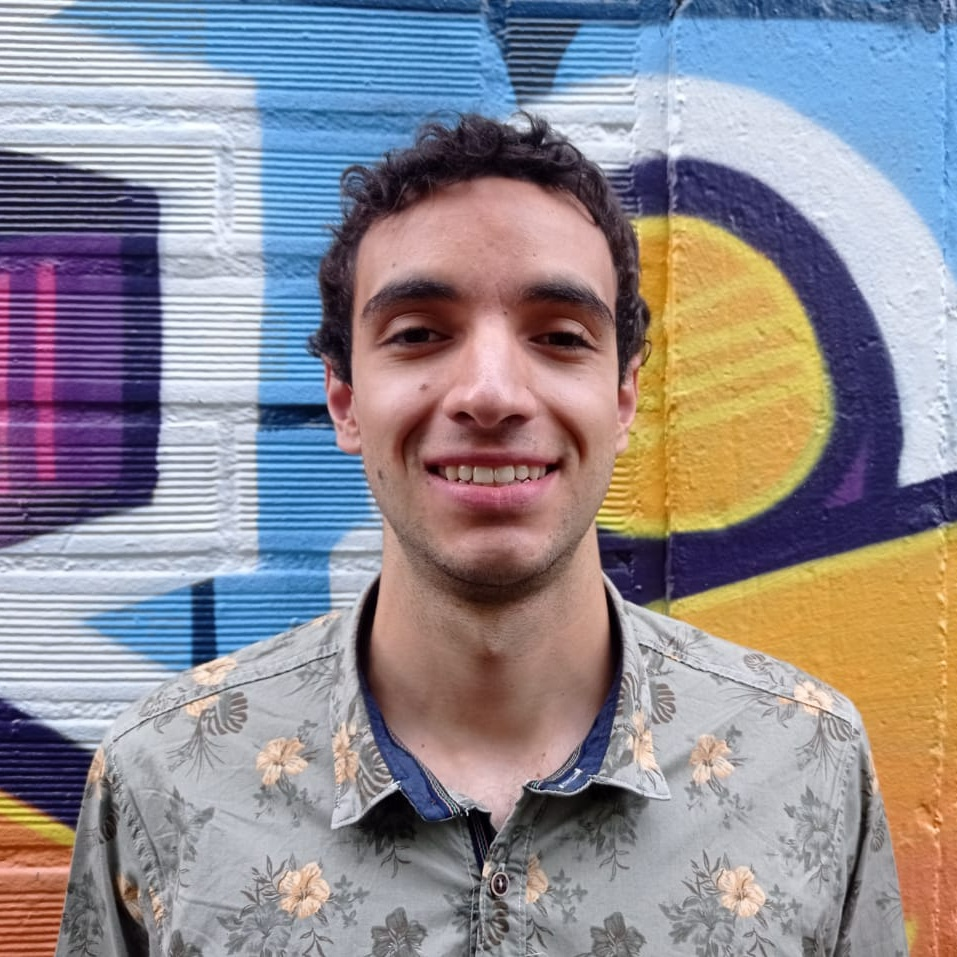

## Projects

* [Coordinates Reader - Ruby - Ruby on Rails](projects/coordinates-reader/README.md)
* [Contribution to Metasploit Framework - Ruby](projects/metasploit-framework/README.md)
* [P'UNK AVENUE Backend Challenge - NodeJS - NestJS](projects/punkave-backend-challenge/README.md)
* [ASCII Art - NodeJS](projects/ascii-art/README.md)
* [Google Summer of Code - Latency Hiding of Host to Device Memory Transfers - LLVM Project - C++](projects/gsoc2020-llvm/README.md)

## Write ups

* [Object-Oriented Design](./write-ups/object-oriented-design.md)
* [Ruby lessons learned](./write-ups/ruby/lessons-learned-ruby.md)
  * [How Async works](./write-ups/ruby/how-async-works.md)
  * [Amazing articles](./write-ups/ruby/amazing-articles.md)
* [Ruby on Rails lessons learned](./write-ups/rails/lessons-learned-rails.md)
  * [HTTP request/response lifecycle](./write-ups/rails/http-request-response-lifecycle.md)
  * [HTTP response lifecycle](./write-ups/rails/http-response-lifecycle.md)
  * [The Asset Pipeline](./write-ups/rails/the-asset-pipeline.md)
* [RSpec lessons learned](./write-ups/lessons-learned-rspec.md)
* [How to use RVM - Ruby Version Manager](./write-ups/how-to-use-rvm.md)
* [How OAuth 2 works](./write-ups/how-oauth2-works.md)
* [Operating Systems lessons learned](./write-ups/lessons-learned-operating-systems.md)

## About Me

I’m a software engineer passionate about acquiring a deep, bare-bones understanding of technology
and using that understanding to solve complex and interesting problems. I have 2 years of experience
testing REST APIs, websites, and event driven architectures using JMeter, Python, and Sitespeed.
I love nature and hip-hop music.

    

## Work Experience

* Linux Sysadmin - Part time - 1 year in 2018-2019 - [Apolo Scientific Computing Center](https://www.eafit.edu.co/apolo)
* Computer Science Research Assistant - 6 months in 2020 - [University of Louisville](https://louisville.edu/)
* Google Summer of Code Student - 3 months in 2020 - [LLVM Project](https://github.com/llvm/llvm-project)
* Performance Engineer - 1 year 4 months - March 2021 to June 2022 - [Perficient](https://www.perficient.com/)
* Performance Tester - From July 2022 - [Endava](https://www.endava.com/)
