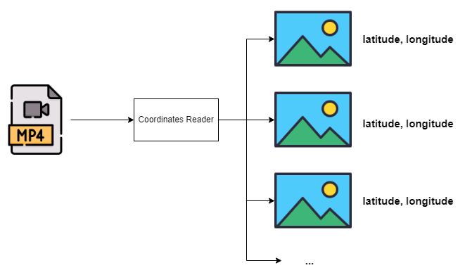

# Coordinates Reader

Ruby on Rails webapp that reads a video that contains coordinates as text, updated per second, and produces
a set of images, one per each coordinate change, with their corresponding coordinates by reading the text in
the video.

## Tech stack

- Ruby 3.2.0.
- Ruby on Rails 7.0.4.
- Text extraction: Tesseract 5.3.0.
- Video processing: FFMPEG.
- Docker.

## Links

- [GitHub](https://github.com/hamax97/coordinates-reader).
