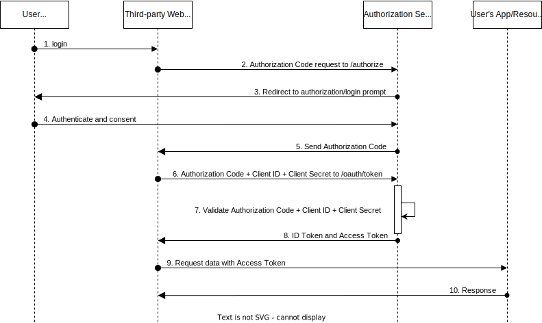

# OAuth 2

<!-- TOC -->

- [Introduction](#introduction)
    - [Problem that OAuth solves](#problem-that-oauth-solves)
    - [OAuth 1.0](#oauth-10)
- [Roles](#roles)
- [Endpoints](#endpoints)
- [Flows a.k.a Grant Types](#flows-aka-grant-types)
    - [Authorization Code Flow](#authorization-code-flow)
- [Resources](#resources)

<!-- /TOC -->

## Introduction

OAuth is a protocol that allows a user to grant a third-party web site or application access to the user's
protected resources, without necessarily revealing their long-term credentials or even their identity.

**Example**

You (the user/resource owner) sign-up in a new web page (the client) that allows you to upload your
resume to show it to potential companies. It has the option to show information from your GitHub (the resource server)
profile (repositories, contributions, ...) For it to access that information it redirects you to
GitHub's authorization server, you enter your credentials, and the authorization server redirects your
browser again to this new web site you're using. Now this new web site has access only to the requested
GitHub information.

### Problem that OAuth solves

Some time ago websites that required to access your information located in other websites (servers)
requested that you would give them your username/password so that they could fetch your information.
This was very insecure. You couldn't trust that these websites would use your credentials only for
what they said they would. Furthermore, if these websites had data leaks your credentials would leak
as well. That's why OAuth was created.

### OAuth 1.0

OAuth 2.0 replaces and obsoles the OAuth 1.0 protocol. There's no backwards compatibility.

## Roles

An OAuth 2.0 flow has the following roles:

- **Resource Owner**: Entity that can grant access to a protected resource. Typically, this is the end-user.
- **Resource Server**: Server hosting the protected resources. This is the API the Client wants to access.
- **Client**: Application requesting access to a protected resource on behalf of the Resource Owner.
- **Authorization Server**: Server that authenticates the Resource Owner and issues access tokens after
  getting proper authorization.

## Endpoints

OAuth 2.0 uses two endpoints:

- [`/authorize`](https://auth0.com/docs/authenticate/protocols/oauth#authorization-endpoint)

  Used to interact with the Resource Owner and get the authorization to access the protected resource.

- [`/oauth/token`](https://auth0.com/docs/authenticate/protocols/oauth#token-endpoint)

  Used by the Client in order to get an access token or a refresh token.

  This is used by all flows except the **Implicit Flow** because in that case an access token is issued
  directly.

## Flows (a.k.a Grant Types)

### Authorization Code Flow

## Resources

- [What is OAuth and why does it matter? - OAuth in Five Minutes](https://www.youtube.com/watch?v=KT8ybowdyr0)
- [An Illustrated Guide to OAuth and OpenID Connect](https://www.youtube.com/watch?v=t18YB3xDfXI)
- [OAuth 2.0 Authorization Framework](https://auth0.com/docs/authenticate/protocols/oauth)
- [OAuth 2.0](https://oauth.net/2/)
- [The OAuth 2.0 Authorization Framework - RFC6 749](https://datatracker.ietf.org/doc/html/rfc6749)