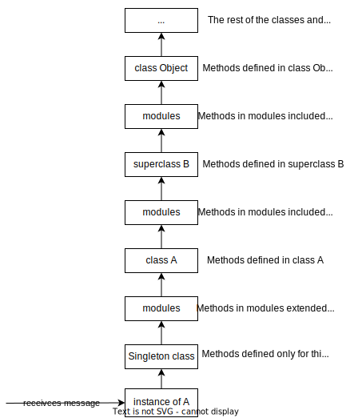

# Lessons learned using Ruby

<!-- TOC -->

- [Method lookup](#method-lookup)
- [Complex regular expressions](#complex-regular-expressions)
- [Exceptions](#exceptions)
- [Memoization in accessors](#memoization-in-accessors)
- [&:symbol - Symbol to Proc | &Proc - Proc to Block | Block to Proc](#symbol---symbol-to-proc--proc---proc-to-block--block-to-proc)
- [Enumerator and Enumerable](#enumerator-and-enumerable)
- [Docker](#docker)
- [Rubocop](#rubocop)
- [Setup Ruby in VSCode](#setup-ruby-in-vscode)

<!-- /TOC -->

## Method lookup



## Complex regular expressions

Use regex literals with the `x` option:

```ruby
%r{
    <regex_part_1> # you can add comments
    <regex_part_2> # and end of lines
}x
```

## Exceptions

- `rescue` without a class will capture `StandardError` and its children.

  - It won't capture Ruby internal errors, which is fine most of the time.

- `raise` with no current exception in `$!` will raise a `RuntimeError` (which is a child of `StandardError`).

Docs: https://docs.ruby-lang.org/en/master/Exception.html

## Memoization in accessors

- Use memoization in accessors when needed.

  ```ruby
  def some_attribute
    @some_attribute ||= some_network_call
  end
  ```

  To avoid calling the network again if the first time it returned `nil` or `false`:

  ```ruby
  def some_attribute
    return @some_attribute if defined? @some_attribute
    @some_attribute = some_network_call
  end
  ```

- To avoid making your code unreadable, use gems that do memoization for you.

Docs: https://www.justinweiss.com/articles/4-simple-memoization-patterns-in-ruby-and-one-gem/

## &:symbol - Symbol to Proc / &Proc - Proc to Block / Block to Proc

<describe>
  <summary>See the specs</summary>
  https://github.com/hamax97/hamax97.github.io/blob/398236cc6f9e4cb4ebae46f36ce8fb94e2b818fb/write-ups/ruby/%26_operator_with_procs.rb#L1-L37
</describe>

## Enumerator and Enumerable

TODO: Complete this.

## Docker

Create a container to test things:

```bash
docker run --rm -it -h myruby --name myruby ruby:3.2.0 /bin/bash
```

## Rubocop

To disable cops or entire departments in specific places of your codebase:

- Disable in a section of code:

```ruby
# rubocop:disable Layout/LineLength, Style
[..]
# rubocop:enable Layout/LineLength, Style
```

- Disable all cops in a section of code:

```ruby
# rubocop:disable all
[..]
# rubocop:enable all
```

- Disable cops or departments in a single line:

```ruby
for x in (0..10) # rubocop:disable Style/For
```

- Disable cops or departments using the `.rubocop.yml` file:

```yml
Style/StringLiterals:
  Enabled: false

AllCops:
  Exclude:
    - 'docs/**/'
```
## Setup Ruby in VSCode

Extensions:

- vscode-ruby by Peng Lv.
- Ruby Solargraph by Castwide.
- Rails Run Specs by Peter Negrei.
- Go to Spec by Lourenci.
- Endiwse.
- ERB Linter.
- ESLint (for JavaScript code).
- Auto Close Tag.
- Github Theme.
- Material Theme Icons.
- vscode-gemfile.
- Ruby Test Explorer.
- Trailing Spaces.
- Auto Markdown TOC.
- VSCode vim, or VSCode Neovim.
- TODO: For debugging?

Gems:

- bundler
- solargraph
- rubocop

Generate solargraph default config file:

```bash
bundle exec solargraph config
```

Settings file `.vscode/settings.json`:

```json
{
    "solargraph.useBundler": true,
    "solargraph.checkGemVersion": false,
    "ruby.lint": {
        "rubocop": {
            "useBundler": true
        }
    },
    "ruby.format": "rubocop",
    "ruby.useBundler": true,
    "auto-close-tag.disableOnLanguage": ["markdown"],
    "ruby.specCommand": "bin/rspec",
    "ruby.specFocusTerminal": false,
    "ruby.specSaveFile": true,
    "markdown-toc.depthFrom": 2,
    "files.insertFinalNewline": true
}
```

Key shortcuts:

- Go to Spec extension:
  - Go to spec of file: `Ctrl + Shift + T`.

- Rails Run Specs extension:
  - Run All Specs: `Ctrl + Windows + r`.
  - Run File Specs: `Ctrl + Windows + t`.
  - Run Spec Line: `Ctrl + Windows + l`.
  - Run Last Spec: `Ctrl + Windows + y`.
